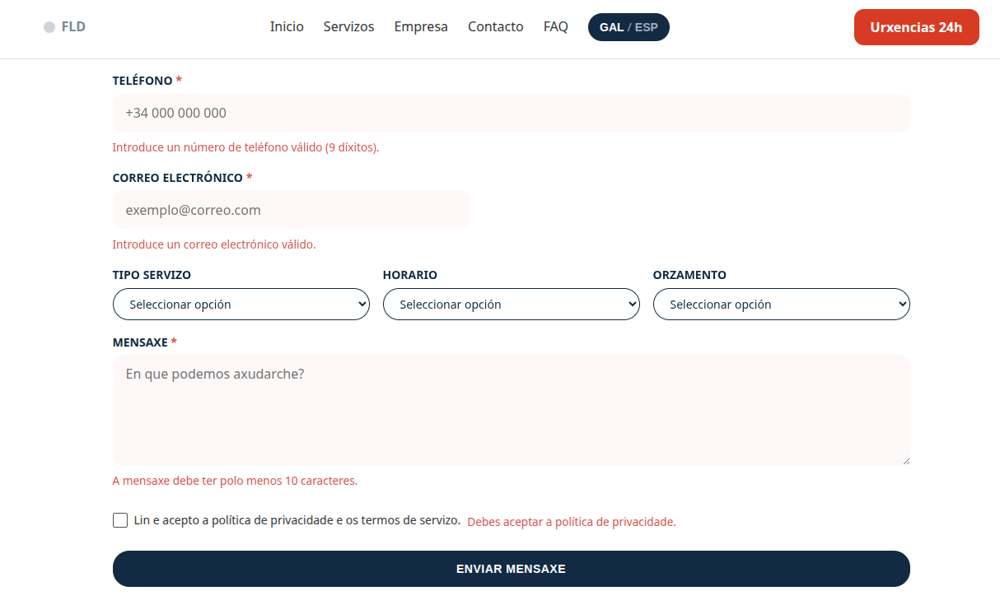
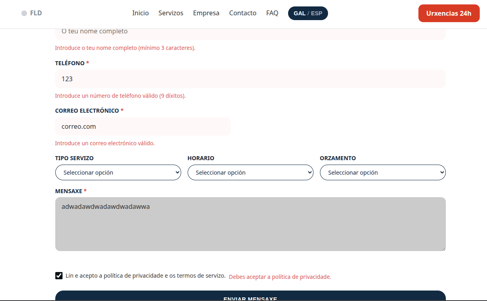
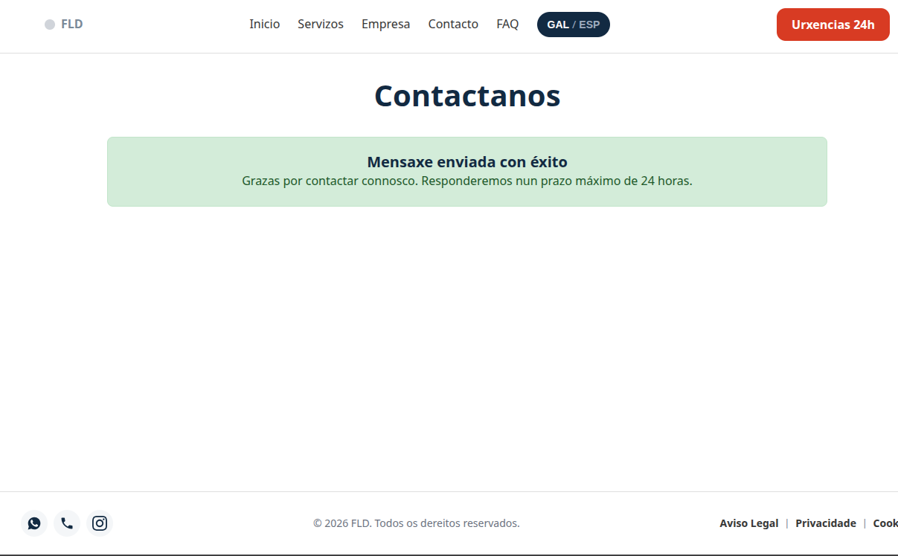

# Fontanaría FLD - Fontanería Fernando López Díaz

## Descripción

Fontanaría FLD es la plataforma web corporativa de Fontanería Fernando López Díaz, empresa especializada en servicios técnicos de fontanería, calefacción, reformas integrales y atención de urgencias 24 horas con cobertura en Sofán, Carballo y la comarca de Bergantiños. El sitio web está diseñado con enfoque multidispositivo y bilingüe (gallego y castellano) para la gestión directa de presupuestos y solicitudes técnicas.

## Contenido

* `index.html`: Página principal con presentación corporativa (Hero), servicios destacados, cuadro de cobertura geográfica y mapa interactivo.
* `empresa.html`: Resumen de trayectoria profesional y bloque de garantías técnicas (Carnet Oficial, Registro Industrial y Atención Local).
* `servizos.html`: Catálogo dinámico de servicios con panel de filtrado por categoría y ordenador interactivo por precio.
* `contacto.html`: Formulario accesible de solicitud de presupuesto con validación en cliente (HTML5 + JS), persistencia de datos y confirmación visual.
* `faq.html`: Sección de preguntas frecuentes con desplegables interactivos tipo acordeón.
* `legal.html`: Texto normativo estructurado adaptado a LSSI-CE y LOPDGDD con anclas de navegación directa.
* `servizos/urxencias.html`: Landing page optimizada para averías urgentes con botón de llamada directa (`tel:`), tiempos de respuesta y guía en 3 pasos.
* `servizos/reformas.html`: Presentación de reformas para particulares y comunidades con tabla técnica de materiales y normativas homologadas.
* `css/styles.css`: Hoja de estilos global estructurada con variables CSS (Design Tokens), arquitectura responsiva y estilos de accesibilidad (`:focus-visible`).
* `js/main.js`: Lógica en JavaScript modular que gestiona el selector bilingüe, menú móvil, catálogo interactivo, validación de formularios y mapas.
* `assets/images/`: Galería de recursos gráficos optimizados para servicios, reformas y banners.

## Características

* Diseño 100% responsivo adaptado a dispositivos móviles, tabletas y monitores de escritorio.
* Menú de navegación móvil tipo hamburguesa y submenú desplegable interactivo.
* Sistema de traducción bilingüe dinámico (Gallego / Castellano) con almacenamiento de preferencia en `localStorage`.
* Catálogo de servicios con filtrado por atributos (`data-category`) y ordenación ascendente/descendente por precio (`data-price`).
* Formulario de contacto accesible (cumplimiento LOPDGDD / RGPD), con mensajes de error contextuales y retención de datos.
* Mapa interactivo de cobertura geográfica integrado con Leaflet.js.
* Búsqueda y ordenación dinámica de tablas técnicas mediante JavaScript.

## Tecnologías utilizadas

* HTML5 Semántico y accesible (Atributos ARIA).
* CSS3 (Flexbox, CSS Grid, Custom Properties / Tokens).
* JavaScript Vanilla (ES6+ Modular).
* Leaflet.js (Mapas interactivos vía CDN).

## Estructura de Directorios

```text
FontaneriaFLD/
│── index.html
│── empresa.html
│── servizos.html
│── contacto.html
│── faq.html
│── legal.html
│
├── servizos/
│   ├── urxencias.html
│   └── reformas.html
│
├── css/
│   └── styles.css
│
├── js/
│   └── main.js
│
├── assets/
│   └── images/
│       ├── urxencias24h.jpg
│       ├── reparacions.jpg
│       ├── reformas.jpg
│       ├── calefaccion.jpg
│       ├── instalacionsanitaria.jpg
│       ├── mantenimiento.jpg
│       ├── comunidade.jpg
│       └── fontaneria.jpg
│
└── README.md


## Mapa de Navegación y Enlazado Cruzado

| Página Origen | Elemento Interactivo | Página Destino / Acción | Propósito / Función |
| :--- | :--- | :--- | :--- |
| **Todas** | Logo `FLD` | `index.html` / `../index.html` | Retorno a la página principal. |
| **Todas** | Nav: `Servizos` | Submenú Desplegable | Acceso directo a `servizos.html`, `urxencias.html` y `reformas.html`. |
| **Todas** | Botón `.btn-emergency` | `servizos/urxencias.html` | Desvío rápido a servicios de emergencia 24h. |
| **`servizos.html`** | Botón `.cardButton` | `contacto.html?servicio=X` | Preselección automática del servicio en el formulario de contacto. |
| **`contacto.html`** | Checkbox Privacidade | `legal.html#privacidade` | Enlace directo a la política de privacidad LOPDGDD/RGPD. |
| **Todas (Footer)** | Enlaces Legales | `legal.html#ancla` | Navegación directa a aviso legal, privacidad o política de cookies. |

## Design System (Tokens CSS)

| Variable CSS | Valor | Aplicación en el Proyecto |
| :--- | :--- | :--- |
| `--color-navy` | `#0A2540` | Color corporativo primario, cabeceras, títulos y fondos oscuros. |
| `--color-blue-primary` | `#0077FF` | Botones de acción estándar, enlaces y estado activo de filtros. |
| `--color-blue-focus` | `#80BFFF` | Indicador de foco de accesibilidad (`:focus-visible`) y elementos interactivos. |
| `--color-red-emergency` | `#D9381E` | Botones de llamada de urgencia, avisos e indicadores de campos requeridos. |
| `--color-bg-light` | `#F4F6F8` | Fondos de secciones secundarias y tarjetas neutras. |
| `--color-white` | `#FFFFFF` | Fondo principal y texto sobre bloques oscuros. |
| `--color-text-main` | `#333333` | Cuerpo de texto principal. |
| `--color-text-sub` | `#6B7280` | Textos auxiliares e información secundaria. |


### Evidencias de Pruebas de Formulario (Fase S13)

#### Prueba 1: Envío con Campos Vacíos
Validación de campos obligatorios mediante JavaScript. El sistema bloquea el envío, aplica `aria-invalid="true"` y muestra mensajes específicos de error debajo de cada entrada requerida.



#### Prueba 2: Datos con Formato Incorrecto
Validación de formato de teléfono, correo electrónico e longitud mínima de texto. Se señalan únicamente los errores en rojo mientras se conservan los datos válidos previamente introducidos.



#### Prueba 3: Cumplimentación de Datos Válidos
Validación de entradas con formatos y sintaxis correctas, incluyendo la verificación del checkbox de aceptación de la política de privacidad LOPDGDD.


#### Prueba 4: Confirmación Visual de Envío
Simulación de recepción técnica. El formulario se oculta tras la validación y se despliega el contenedor visual `#formSuccess` notificando la correcta recepción del mensaje.


