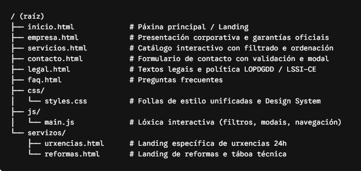
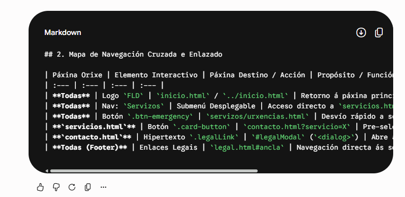

<<<<<<< HEAD
Fontanaría FLD

1. Estrutura de Arquivos e Directorios

2. Mapa de Navegación Cruzada e Enlazado

## 2. Mapa de Navegación Cruzada e Enlazado

| Páxina Orixe | Elemento Interactivo | Páxina Destino / Acción | Propósito / Función |
| :--- | :--- | :--- | :--- |
| **Todas** | Logo `FLD` | `inicio.html` / `../inicio.html` | Retorno á páxina principal. |
| **Todas** | Nav: `Servizos` | Submenú Desplegable | Acceso directo a `servicios.html`, `urxencias.html` e `reformas.html`. |
| **Todas** | Botón `.btn-emergency` | `servizos/urxencias.html` | Desvío rápido a servizos de emerxencia 24h. |
| **`servicios.html`** | Botón `.card-button` | `contacto.html?servicio=X` | Pre-selección do servizo no formulario de contacto. |
| **`contacto.html`** | Hipertexto `.legalLink` | `#legalModal` (`<dialog>`) | Abre a política LOPDGDD en modal sen saír do formulario. |
| **Todas (Footer)** | Enlaces Legais | `legal.html#ancla` | Navegación directa ás seccións de aviso legal, privacidade ou cookies. |

3. Especificación Funcional por Páxina

- inicio.html: Presentación xeral da empresa, chamada á acción principal (Hero), reixa de servizos destacados e mapa de cobertura xeográfica.

- empresa.html: Resumo da traxectoria profesional de Fernando López Díaz e bloque de garantías con tres tarxetas informativas (Carné Oficial, Rexistro Industrial e Atención Local).

- servicios.html: Catálogo dinámico de servizos. Contén un panel de filtrado por categorías (data-category) e un selector de ordenación por prezo (data-price). En caso de non atopar coincidencias, móstrase a liña de estado baleiro #noResults.

- contacto.html: Formulario de solicitude de orzamento equipado con patróns de validación HTML5 (pattern, minlength, maxlength), tres selectores de opcións e casilla de aceptación LOPDGDD conectada ao modal informativo.

- legal.html: Texto normativo completo en galego estándar adaptado á LSSI-CE e LOPDGDD, estruturado con identificadores id para permitir o salto por anclas.

- servizos/urxencias.html: Páxina técnica de alta conversión para avarías urxentes, con botón de chamada directa (tel:), tempos de resposta e guía paso a paso de resolución.

- servizos/reformas.html: Presentación de liñas de traballo para particulares e comunidades de veciños, complementada cunha táboa de materiais e normativas homologadas (UNE-EN, ISO).

4. Tokens do Design System (css/styles.css)

VariableCSS	            Valor	      Aplicación no Proxecto

--color-navy	        #0A2540	Cor corporativa primaria, cabeceiras, títulos e fondos escuros.
--color-blue-primary	#0077FF	Botóns de acción estándar, ligazóns e estado activo de filtros.
--color-blue-focus	    #80BFFF	Indicador de foco de accesibilidade (:focus-visible) e botóns informativos.
--color-red-emergency	#D9381E	Botóns de chamada de urxencia e avisos de emerxencia.
--color-bg-light	    #F4F6F8	Fondos de seccións secundarias e tarxetas neutras.
--color-white	        #FFFFFF	Fondo principal e texto sobre bloques escuros.
--color-text-main	    #333333	Corpo de texto principal.
--color-text-sub	    #6B7280	Textos auxiliares e secundarios.

 --Proximamente--

 
5. Responsive
6. Módulos e Lóxica JavaScript (js/main.js)
=======
Fontanaría FLD

1. Estrutura de Arquivos e Directorios

2. Mapa de Navegación Cruzada e Enlazado

## 2. Mapa de Navegación Cruzada e Enlazado

| Páxina Orixe | Elemento Interactivo | Páxina Destino / Acción | Propósito / Función |
| :--- | :--- | :--- | :--- |
| **Todas** | Logo `FLD` | `inicio.html` / `../inicio.html` | Retorno á páxina principal. |
| **Todas** | Nav: `Servizos` | Submenú Desplegable | Acceso directo a `servicios.html`, `urxencias.html` e `reformas.html`. |
| **Todas** | Botón `.btn-emergency` | `servizos/urxencias.html` | Desvío rápido a servizos de emerxencia 24h. |
| **`servicios.html`** | Botón `.card-button` | `contacto.html?servicio=X` | Pre-selección do servizo no formulario de contacto. |
| **`contacto.html`** | Hipertexto `.legalLink` | `#legalModal` (`<dialog>`) | Abre a política LOPDGDD en modal sen saír do formulario. |
| **Todas (Footer)** | Enlaces Legais | `legal.html#ancla` | Navegación directa ás seccións de aviso legal, privacidade ou cookies. |

3. Especificación Funcional por Páxina

- inicio.html: Presentación xeral da empresa, chamada á acción principal (Hero), reixa de servizos destacados e mapa de cobertura xeográfica.

- empresa.html: Resumo da traxectoria profesional de Fernando López Díaz e bloque de garantías con tres tarxetas informativas (Carné Oficial, Rexistro Industrial e Atención Local).

- servicios.html: Catálogo dinámico de servizos. Contén un panel de filtrado por categorías (data-category) e un selector de ordenación por prezo (data-price). En caso de non atopar coincidencias, móstrase a liña de estado baleiro #noResults.

- contacto.html: Formulario de solicitude de orzamento equipado con patróns de validación HTML5 (pattern, minlength, maxlength), tres selectores de opcións e casilla de aceptación LOPDGDD conectada ao modal informativo.

- legal.html: Texto normativo completo en galego estándar adaptado á LSSI-CE e LOPDGDD, estruturado con identificadores id para permitir o salto por anclas.

- servizos/urxencias.html: Páxina técnica de alta conversión para avarías urxentes, con botón de chamada directa (tel:), tempos de resposta e guía paso a paso de resolución.

- servizos/reformas.html: Presentación de liñas de traballo para particulares e comunidades de veciños, complementada cunha táboa de materiais e normativas homologadas (UNE-EN, ISO).

4. Tokens do Design System (css/styles.css)

VariableCSS	            Valor	      Aplicación no Proxecto

--color-navy	        #0A2540	Cor corporativa primaria, cabeceiras, títulos e fondos escuros.
--color-blue-primary	#0077FF	Botóns de acción estándar, ligazóns e estado activo de filtros.
--color-blue-focus	    #80BFFF	Indicador de foco de accesibilidade (:focus-visible) e botóns informativos.
--color-red-emergency	#D9381E	Botóns de chamada de urxencia e avisos de emerxencia.
--color-bg-light	    #F4F6F8	Fondos de seccións secundarias e tarxetas neutras.
--color-white	        #FFFFFF	Fondo principal e texto sobre bloques escuros.
--color-text-main	    #333333	Corpo de texto principal.
--color-text-sub	    #6B7280	Textos auxiliares e secundarios.

 --Proximamente--

 
5. Responsive
6. Módulos e Lóxica JavaScript (js/main.js)
>>>>>>> 40ea0b0c8d4b406165406afa6784acf83a68ce80
