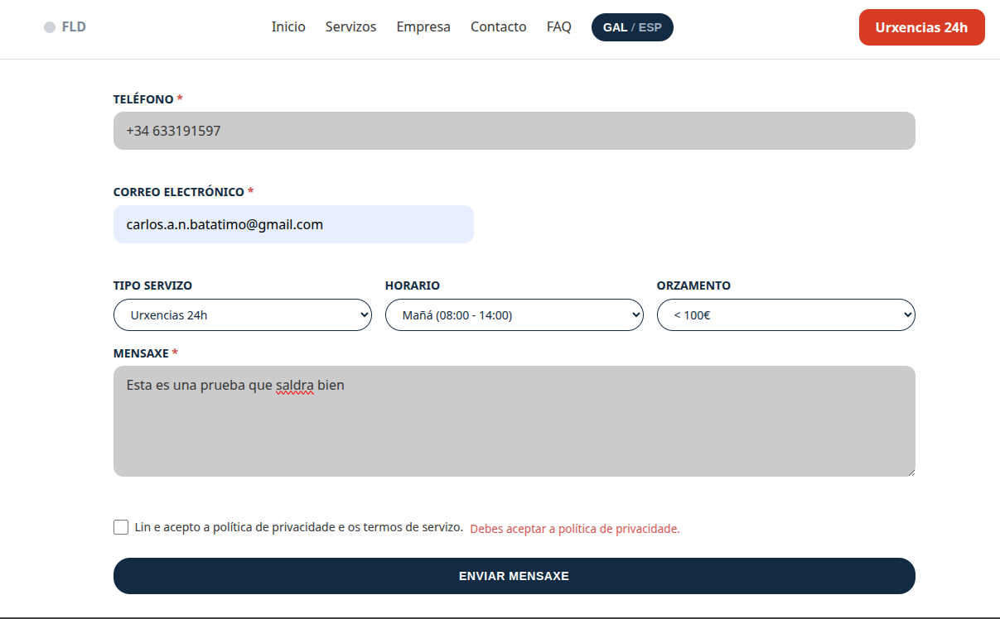
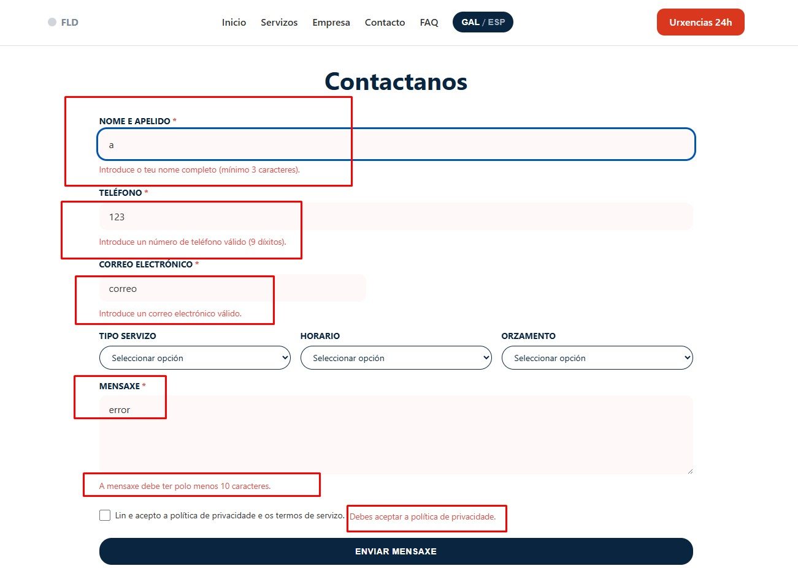
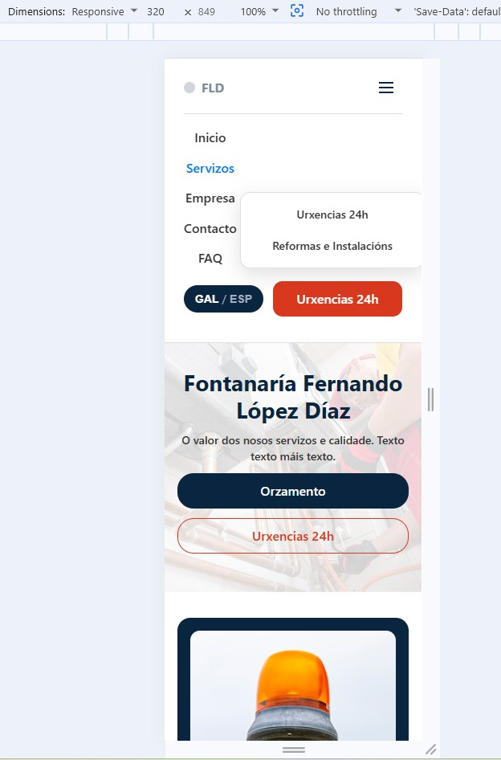

# Fontanaría FLD - Fontanería Fernando López Díaz

## Descrición

Fontanaría FLD é o sitio web corporativo de Fontanaría Fernando López Díaz, unha empresa especializada en servizos técnicos de fontanaría e calefacción, reformas integrais e asistencia de urxencia as 24 horas, que presta servizo en Sofán, Carballo e a comarca de Bergantiños. O sitio conta cun deseño bilingüe (galego e castelán) e adaptado a múltiples dispositivos, o que facilita a xestión directa de orzamentos e solicitudes de servizo técnico.

## Contido

* `index.html`: Páxina principal que inclúe unha presentación corporativa (sección *Hero*), servizos destacados, un gráfico de cobertura xeográfica e un mapa interactivo.
* `empresa.html`: Resumo da traxectoria profesional e sección que detalla as credenciais técnicas (certificación oficial, rexistro industrial e soporte local).
* `servizos.html`: Catálogo dinámico de servizos con panel de filtrado por categorías e ferramenta interactiva para ordenar prezos.
* `contacto.html`: Formulario de solicitude de orzamento accesible, con validación no lado do cliente (HTML5 + JS), persistencia de datos e confirmación visual.
* `faq.html`: Sección de preguntas frecuentes con menús despregables interactivos tipo acordeón.
* `legal.html`: Texto legal estruturado conforme á normativa LSSI-CE e LOPDGDD, con ancoraxes para navegación directa.
* `servizos/urxencias.html`: Páxina de destino optimizada para reparacións urxentes, con botón de chamada directa (`tel:`), tempos de resposta e guía de 3 pasos.
* `servizos/reformas.html`: Presentación de servizos de reforma para particulares e comunidades de propietarios, incluíndo unha táboa técnica de materiais e normativas homologadas.
* `css/styles.css`: Folla de estilos global estruturada con variables CSS (*Design Tokens*), arquitectura *responsive* e estilos de accesibilidade (`:focus-visible`).
* `js/main.js`: Lóxica JavaScript modular que xestiona o selector de idioma, o menú para móbiles, o catálogo interactivo, a validación de formularios e os mapas.
* `assets/images/`: Galería de recursos gráficos optimizados para servizos, reformas e *banners*.

## Características

* Deseño 100 % adaptativo (*responsive*) para dispositivos móbiles, tabletas e monitores de escritorio.
* Menú de navegación móbil tipo "hamburguesa" e submenú despregable interactivo.
* Sistema de tradución bilingüe dinámica (galego/español) con almacenamento de preferencias en `localStorage`.
* Catálogo de servizos con filtrado por atributos (`data-category`) e ordenación de prezos ascendente/descendente (`data-price`).
* Formulario de contacto accesible (conforme á LOPDGDD/RGPD) con mensaxes de erro contextuais e retención de datos.
* Mapa interactivo de cobertura xeográfica integrado mediante Leaflet.js.
* Busca e ordenación dinámicas para táboas técnicas mediante JavaScript.

## Tecnoloxías empregadas

* HTML5 semántico e accesible (atributos ARIA).
* CSS3 (Flexbox, CSS Grid, propiedades personalizadas/tokens).
* Vanilla JavaScript (modular, ES6+).
* Leaflet.js (mapas interactivos vía CDN).

## Estrutura de directorios

```text
FontaneriaFLD/
│── index.html
│── empresa.html
│── servizos.html
│── contacto.html
│── faq.html
│── legal.html
│
├── servizos/
│   ├── urxencias.html
│   └── reformas.html
│
├── css/
│   └── styles.css
│
├── js/
│   └── main.js
│
├── assets/
│   └── images/
│       ├── urxencias24h.jpg
│       ├── reparacions.jpg
│       ├── reformas.jpg
│       ├── calefaccion.jpg
│       ├── instalacionsanitaria.jpg
│       ├── mantenimiento.jpg
│       ├── comunidade.jpg
│       └── fontaneria.jpg
│
└── README.md
```


## Mapa de navegación e ligazóns cruzadas

| Página Origen | Elemento Interactivo | Página Destino / Acción | Propósito / Función |
| :--- | :--- | :--- | :--- |
| **Todas** | Logo `FLD` | `index.html` / `../index.html` | Retorno a la página principal. |
| **Todas** | Nav: `Servizos` | Submenú Desplegable | Acceso directo a `servizos.html`, `urxencias.html` y `reformas.html`. |
| **Todas** | Botón `.btn-emergency` | `servizos/urxencias.html` | Desvío rápido a servicios de emergencia 24h. |
| **`servizos.html`** | Botón `.cardButton` | `contacto.html?servicio=X` | Preselección automática del servicio en el formulario de contacto. |
| **`contacto.html`** | Checkbox Privacidade | `legal.html#privacidade` | Enlace directo a la política de privacidad LOPDGDD/RGPD. |
| **Todas (Footer)** | Enlaces Legales | `legal.html#ancla` | Navegación directa a aviso legal, privacidad o política de cookies. |

## Design System (Tokens CSS)

| Variable CSS | Valor | Aplicación en el Proyecto |
| :--- | :--- | :--- |
| `--color-navy` | `#0A2540` | Color corporativo primario, cabeceras, títulos y fondos oscuros. |
| `--color-blue-primary` | `#0077FF` | Botones de acción estándar, enlaces y estado activo de filtros. |
| `--color-blue-focus` | `#80BFFF` | Indicador de foco de accesibilidad (`:focus-visible`) y elementos interactivos. |
| `--color-red-emergency` | `#D9381E` | Botones de llamada de urgencia, avisos e indicadores de campos requeridos. |
| `--color-bg-light` | `#F4F6F8` | Fondos de secciones secundarias y tarjetas neutras. |
| `--color-white` | `#FFFFFF` | Fondo principal y texto sobre bloques oscuros. |
| `--color-text-main` | `#333333` | Cuerpo de texto principal. |
| `--color-text-sub` | `#6B7280` | Textos auxiliares e información secundaria. |


### Evidencia de probas de formularios (Fase S13)


#### Proba 1: Envío con campos baleiros
Validación de campos obrigatorios mediante JavaScript. O sistema bloquea o envío, aplica `aria-invalid="true"` e mostra mensaxes de erro específicas debaixo de cada campo obrigatorio.


#### Proba 2: Datos con formato incorrecto
Validación dos formatos de número de teléfono e correo electrónico, así como da lonxitude mínima do texto. Só se resaltan en vermello os erros, mentres que se manteñen os datos válidos introducidos anteriormente.


#### Proba 3: Envío de datos válidos
Validación de datos de entrada con formatos e sintaxe correctos, incluíndo a verificación da casiña de aceptación da política de privacidade da LOPDGDD.



#### Proba 4: Confirmación visual do envío
Simulación dunha recepción correcta. O formulario ocúltase tras a validación e móstrase o contedor visual `#formSuccess`, que notifica que a mensaxe se recibiu correctamente.


## Auditoría e Plan de Probas (Fase S14)

A execución e verificación detallada dos 14 casos de proba funcionais, de accesibilidade e de maquetación adaptativa atópase documentada no arquivo dedicado:

👉 **[Ver Plan de Probas e Matriz de Execución (docs/plan-de-probas.md)](docs/plan-de-probas.md)**

## Evidencias Visuais de Probas (Fase S14)

* **Validación de Formulario (Errores)**: Campos resaltados en vermello e mensaxes contextuales ao intentar enviar datos baleiros ou incorrectos.
  
  

* **Confirmación de Envío Correcto**: Ocultación do formulario e despliegue do cadro verde `#formSuccess` tras un envío válido.
  
  

* **Navegación Adaptativa (Móbil)**: Despregue fluído do menú hamburguesa e submenú en resolución de 375px.
  
  

* **Informe de Accesibilidade e Rendemento (Fase S15)**: [docs/informe-accesibilidade-rendemento.md](docs/informe-accesibilidade-rendemento.md)